# TyControls

A skinnable / styleable **Lazarus component library**: every control is fully custom-drawn
(BGRABitmap) and its appearance is driven uniformly by lightweight CSS-lite text themes
(`.tycss`), rendering pixel-identical on Windows / Linux / macOS.

> **中文:** [README.md](README.md) · **Changelog:** [CHANGELOG.en.md](CHANGELOG.en.md)

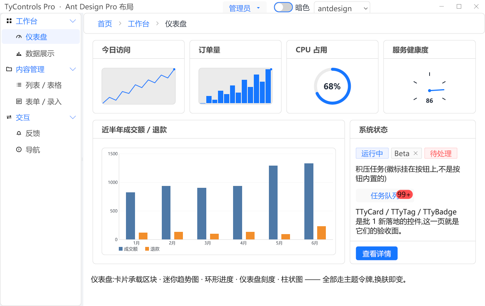

**Same program, one theme name changed:**

| `classic` | `win11` | `material3` |
|---|---|---|
| 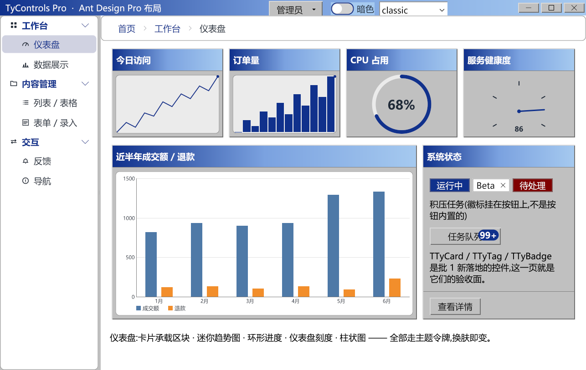 | 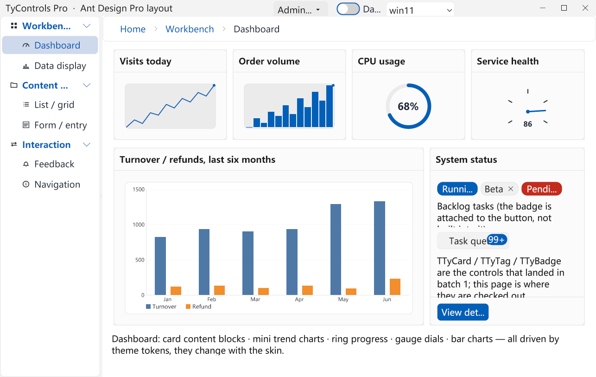 | 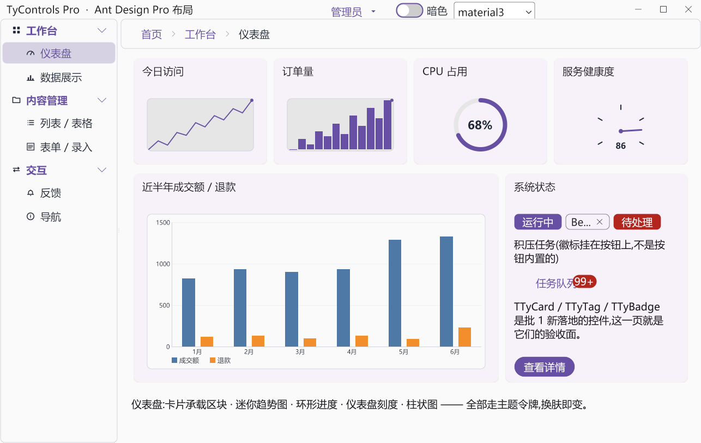 |

All four are the **same `.lfm` and the same application code** — only the theme name differs.
Not one control hardcodes a colour, corner radius or line width; every visual value comes from
a theme token. Look at `classic`: it isn't just recoloured — the 3D button bevels, the gradient
header band and the square corners changed too.

### Light / dark / image themes

The gallery example (`examples/demo`), same form:

| Light | Dark | `green` (image theme) |
|---|---|---|
| 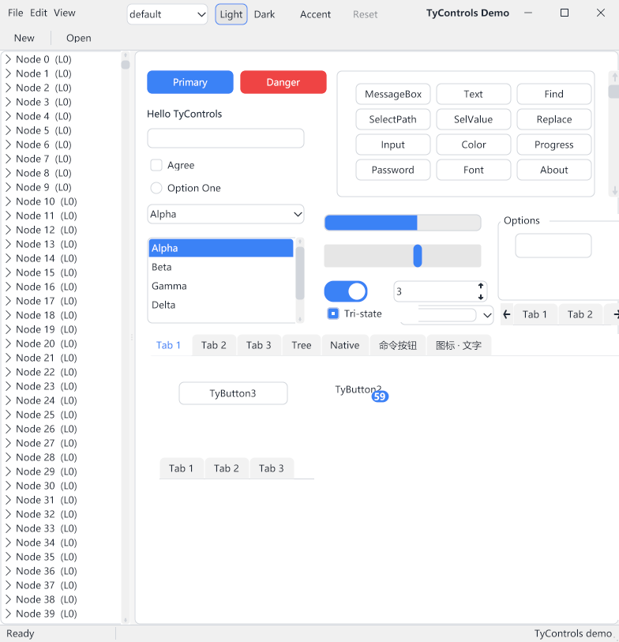 | 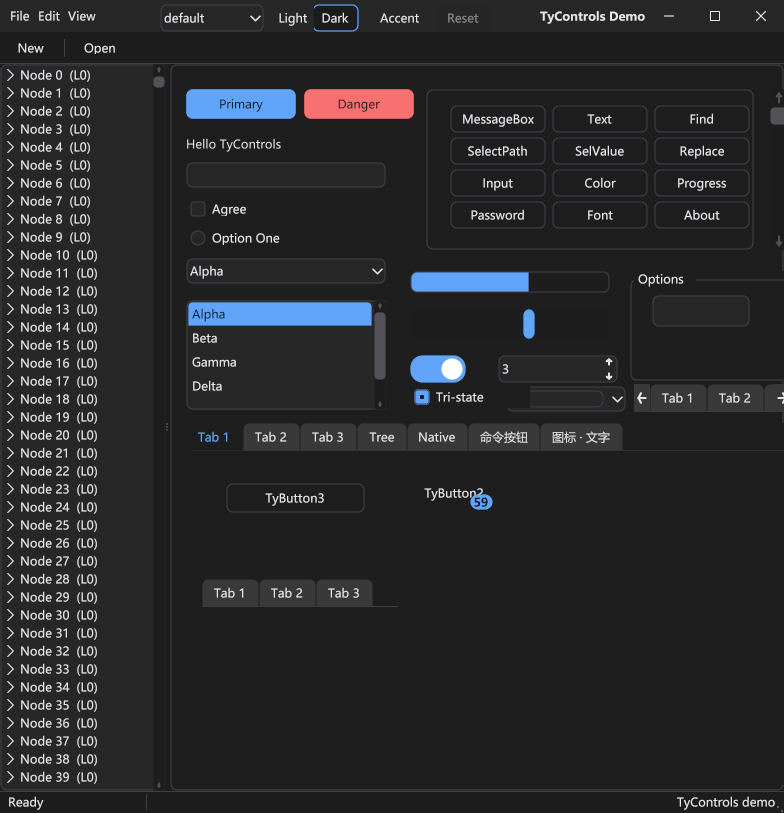 | 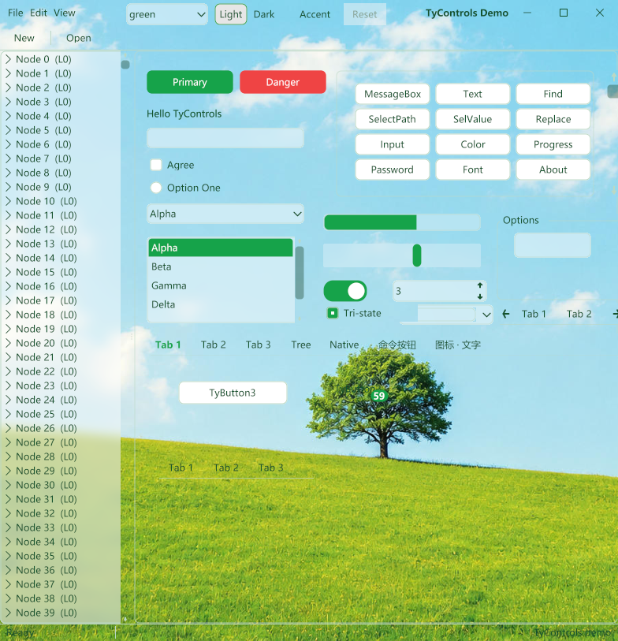 |

Light and dark are two sets of `@mode` values in one `.tycss`, and can follow the OS. `green`
shows how far a theme can go — translucent controls floating over a photo background, built from
9-slice images and the `alpha()` colour function, with not one line of control code changed for it.

### A few of the controls

| | |
|---|---|
| **`TTyStringGrid`** — frozen columns, row-number gutter, summary band, cell mark colours<br>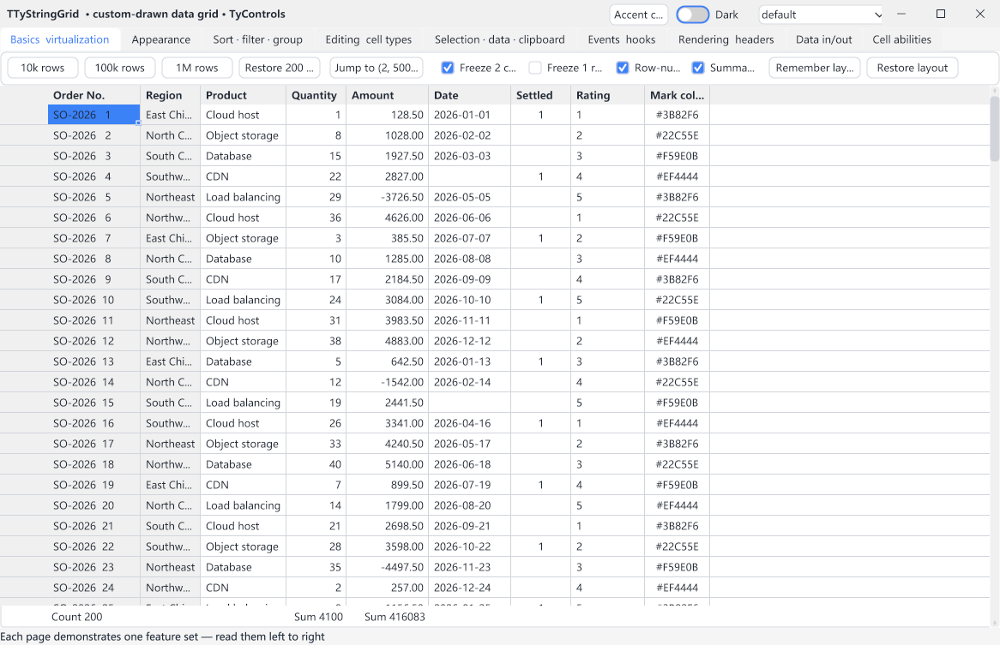 | **`TTyTreeView`** — virtual tree, multi-column, tri-state checks<br>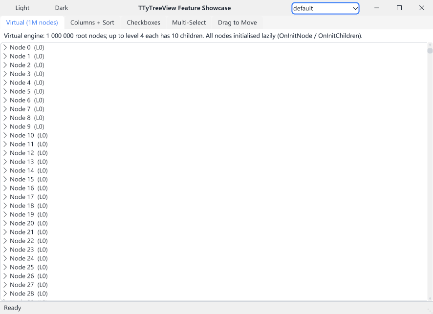 |
| **Rich input controls** — numeric / currency / mask / slider / calculator edits<br>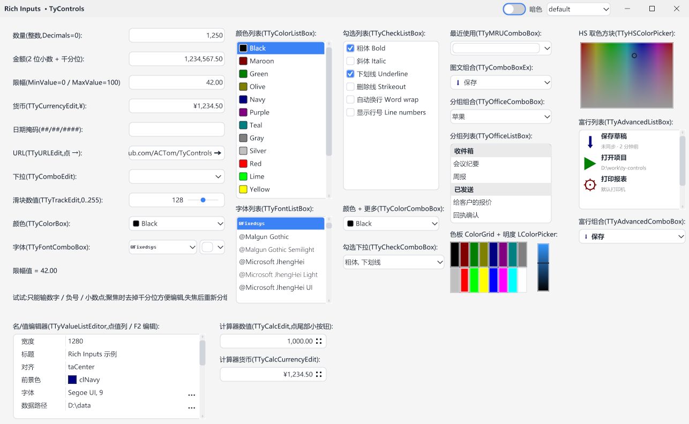 | **Custom-drawn dialogs** — colour picker: HSV + RGB / CMYK / Alpha, all two-way<br>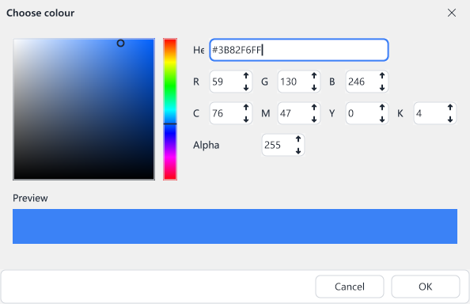 |

---

## Features

- **Fully custom-drawn** — every control is painted with BGRABitmap; nothing wraps a native
  control. The same code is the same pixels on Windows, Linux and macOS.
- **Appearance separated from code** — colours, radii, borders, padding, font sizes, shadows,
  gradients and 9-slice images all live in `.tycss` text. Restyling needs no recompile;
  `LoadTheme` hot-swaps at runtime.
- **Structural skinning** — a theme is more than a palette: `render-style` turns a flat button
  into a 3D bevelled one, and geometry tokens change a control's intrinsic size.
- **Two density scales** — classic (Win32 scale) and modern (web scale) are an axis
  **orthogonal** to colour, switched by one `Controller.Density` property.
- **Follows the OS** — light/dark mode and accent colour can track the operating system; a
  single-file `@mode` carries both sets of values.
- **160 droppable controls** across 16 component-palette pages — see the [control list](#control-list).
- **Designer-first** — `TTyPageControl`'s pages and `TTyGridPanel`'s cells are **real designer
  containers**: drop controls straight in, see the finished look in the designer, and it persists
  to the `.lfm` with no layout code. Theme changes show up in the designer too.
- **HiDPI** — every length scales by PPI; vector drawing stays crisp.
- **Internationalised** — the library's own UI strings go through `resourcestring` + `.po`,
  shipped in English and Simplified Chinese.
- **3949 unit tests**, whole suite leak-free (heaptrc-verified). Appearance additionally has a
  pixel-level golden guard — every change to a theme's resolved styles must be deliberate.

---

## Quick start

**1. Install the package**

In Lazarus open `tycontrols_dt.lpk` (the design-time package) → **Use → Install**; the IDE
recompiles and restarts. The runtime package `tycontrols.lpk` comes in automatically as a
dependency.

> Requires: Lazarus 3.x+ / FPC 3.2.2+ / **BGRABitmap** (OPM package `BGRABitmapPack`).

**2. New project**

**File → New… → Project → TyControls Application**

The template gives you a wired-up `TTyForm` main form: custom-drawn title bar, the content-host
container `Surface`, and a `TTyStyleController`, all in place and associated. Drop controls onto
`Surface`.

> To add a form to an existing project use **File → New… → Form → TyControls Form**.

**3. Switch theme**

Select the `TTyStyleController` on the main form and set `ThemeName` to any built-in name
(`default` / `system` / `win11` / `classic` / `material3` / …). The designer updates instantly;
change the same property at runtime to hot-swap.

Full steps (first form, theme switching, HiDPI, deployment) → **[docs/getting-started.md](docs/getting-started.md)**.

---

## Form structure

A `TTyForm`'s controls live on a content-host container, **`TTyFormSurface`** — exactly one per
form, named `Surface`, filling the whole window. **Put your controls inside it.**

- **New forms need no thought**: both templates ship with `Surface` already there, and dropping
  a control in the designer lands it inside.
- **Graphic controls MUST go inside**: windowless graphic controls like `TTyLabel` and
  `TTyShape` paint onto their parent — placed on the form directly they are hidden behind
  `Surface`. The designer warns you when you do this.
- **Non-visual components stay on the form**: style controllers, timers, dialog components,
  image lists, menus are unaffected.
- **Dialogs (`TTyDialog`) have no `Surface`**: they are not resizable and do not need one;
  place controls directly on them.

**Why it exists — the root cause is Windows.** A resizable top-level window carries
`WS_THICKFRAME`, and Windows gives it a DWM backing surface *smaller* than its visible rect (only
`windowHeight - 2*frame` tall). Its own GDI client DC is therefore clipped short, leaving a dead
band along the right and bottom edges that simply cannot be painted. A child window has no thick
frame, its backing surface spans its full rect, and it paints edge to edge — so `TTyForm` renders
its themed background onto `Surface` rather than onto itself.

The container is harmless on every widgetset, so it is not forked per platform. It also solves a
second problem: because your controls are `Surface`'s **children**, windowless controls such as
`TTyLabel` paint onto `Surface`'s own canvas and stay visible — a plain back-most layer would
occlude them instead.

Select `Surface` in the designer; its `Purpose` property says the same thing.

---

## Control list

160 controls you can drop from the component palette, across 16 pages. Per-control
properties / events / states / theme keys are in **[docs/controls/](docs/controls/)**.

### Core · `TyControls` (2)

| Control | What it is for |
|---|---|
| `TTyStyleController` | The style controller: loads themes, switches density, follows the OS light/dark. Controls read their style through it |
| `TTyNativeStyler` | Themes native / third-party LCL controls to match |

### Buttons · `TyControls Buttons` (8)

| Control | What it is for |
|---|---|
| `TTyButton` | The base button; primary / danger / ghost variants and a numeric badge |
| `TTyGlyphButton` | Button with an icon from an icon font or image collection |
| `TTyGlyphContainerButton` | Square icon-only button, typical on toolbars |
| `TTySpeedButton` | Shortcut button that can stay pressed |
| `TTyDropDownButton` | Split button: the left half acts, the right half opens a menu |
| `TTyMenuButton` | The whole button is the dropdown trigger |
| `TTyColorButton` | Button showing and picking a colour |
| `TTyButtonGroup` | Segmented bar; adjacent segments share edges, one selected |

### Labels & marks · `TyControls Labels` (7)

| Control | What it is for |
|---|---|
| `TTyLabel` | Text label with word wrap (including per-glyph CJK breaking) and mnemonics |
| `TTyHtmlLabel` | Label supporting an inline HTML subset (bold / italic / link / colour) |
| `TTyLinkLabel` | Hyperlink text with underline and hover highlight |
| `TTyShadowLabel` | Label with a drop shadow |
| `TTyGlowLabel` | Label with a blurred glow |
| `TTyTag` | Closable tag pill, for filters and status marks |
| `TTyBadge` | Numeric / dot badge that can anchor to any control's corner |

### Text & numeric input · `TyControls Edits` (13)

| Control | What it is for |
|---|---|
| `TTyEdit` | Single-line edit: selection, clipboard, word navigation, horizontal scroll |
| `TTyMemo` | Multi-line edit: 2D navigation, cross-line editing, vertical scroll |
| `TTySpinEdit` | Numeric field with up/down arrows |
| `TTyNumericEdit` | Digits-only field, group-formatted on blur |
| `TTyCurrencyEdit` | Currency field that adds the symbol |
| `TTyMaskEdit` | Input constrained by a mask (phone, ID, date) |
| `TTyURLEdit` | URL field with a trailing open button |
| `TTyComboEdit` | Edit plus a dropdown arrow; you decide what drops down |
| `TTyTrackEdit` | Edit with an inline slider - type it or drag it |
| `TTyCalcEdit` | Edit with an inline calculator button |
| `TTyCalcCurrencyEdit` | The currency flavour of the calculator edit |
| `TTyCalculator` | Standalone calculator panel |
| `TTyUpDown` | Standalone up/down spinner, bindable to another control |

### Choices & switches · `TyControls Choices` (6)

| Control | What it is for |
|---|---|
| `TTyCheckBox` | Check box, tri-state capable |
| `TTyRadioButton` | Radio button |
| `TTyToggleSwitch` | Switch whose knob slides between states |
| `TTyRadioGroup` | Titled frame of auto-laid-out radio buttons |
| `TTyCheckGroup` | Titled frame of check boxes |
| `TTySegmented` | Segmented control: pick one value from a row, not one page |

### Lists & dropdowns · `TyControls Lists` (14)

| Control | What it is for |
|---|---|
| `TTyComboBox` | Dropdown, editable, with prefix autocomplete |
| `TTyListBox` | Item list with keyboard navigation and an embedded scrollbar |
| `TTyCheckListBox` | List with a check box per row |
| `TTyMRUComboBox` | Dropdown that promotes recent entries to the top |
| `TTyComboBoxEx` | Dropdown with a per-item image |
| `TTyOfficeComboBox` | Dropdown with group header bands |
| `TTyOfficeListBox` | List with group header bands |
| `TTyAdvancedComboBox` | Two-line items (title + subtitle + image) |
| `TTyAdvancedListBox` | Rich two-line list |
| `TTyCheckComboBox` | Multi-select dropdown; the field shows a summary |
| `TTyValueListEditor` | Property grid: key on the left, value on the right, editor kind per row |
| `TTyTransfer` | Two lists with move-between buttons |
| `TTyTreeSelect` | Selector whose dropdown is a tree |
| `TTyCascader` | Cascading multi-column selector |

### Colour / font / file pickers · `TyControls Pickers` (11)

| Control | What it is for |
|---|---|
| `TTyColorBox` | Colour dropdown with a swatch per item |
| `TTyColorComboBox` | Colour dropdown with a trailing More... entry opening the colour dialog |
| `TTyColorListBox` | Colour list |
| `TTyColorGrid` | Swatch grid palette |
| `TTyLColorPicker` | Lightness bar picker |
| `TTyHSColorPicker` | Hue / saturation plane picker |
| `TTyFontComboBox` | Font dropdown; each item previews in its own typeface |
| `TTyFontListBox` | Font list |
| `TTyFontSizeComboBox` | Font-size dropdown |
| `TTyFilterComboBox` | File-type filter dropdown |
| `TTyShellComboBox` | Directory dropdown, pairs with the file views |

### Gauges & indicators · `TyControls Gauges` (12)

| Control | What it is for |
|---|---|
| `TTyGauge` | Gauge in linear, arc or ring form |
| `TTyMeter` | Needle gauge with tick marks |
| `TTyLevelMeter` | VU meter: lit segments plus a peak-hold marker |
| `TTyDial` | Rotary knob |
| `TTyGearDial` | Decorative knob with a toothed rim |
| `TTyAnalogClock` | Analogue clock face |
| `TTyCircularProgress` | Ring progress with a centred percentage |
| `TTyActivityIndicator` | Spinning busy ring |
| `TTyActivityBar` | Indeterminate marching bar |
| `TTyGearActivityIndicator` | Gear-shaped busy indicator |
| `TTySparkline` | Mini trend chart for cards and table cells |
| `TTyRating` | Star rating with hover preview |

### Bars · `TyControls Bars` (14)

| Control | What it is for |
|---|---|
| `TTyTrackBar` | Slider |
| `TTyProgressBar` | Progress bar |
| `TTyScrollBar` | Scroll bar |
| `TTyStatusBar` | Bottom status bar with panels |
| `TTyToolBar` | Tool bar |
| `TTyToolSeparator` | Tool bar separator |
| `TTyToolBarEx` | Tool bar that folds what does not fit into an overflow menu |
| `TTyControlBar` | Container that wraps child controls into bands (packing only -- no drag yet) |
| `TTyCoolBar` | Windows-style draggable band bar |
| `TTyAlert` | Inline banner: info / success / warning / error |
| `TTyPagination` | Pager |
| `TTySteps` | Wizard step bar, horizontal or vertical |
| `TTyBreadcrumb` | Breadcrumb trail |
| `TTyHeaderControl` | Standalone column header strip; resizable and sortable |

### Containers & layout · `TyControls Containers` (20)

| Control | What it is for |
|---|---|
| `TTyPanel` | Base panel |
| `TTyGroupBox` | Titled group frame |
| `TTyCard` | Card: title / content / actions |
| `TTyExPanel` | Collapsible panel with an expander arrow in its header |
| `TTyScrollBox` | Scrollable container |
| `TTyScrollPanel` | Container that auto-scrolls when you drag near its edge |
| `TTyGridPanel` | **Designer grid**: set rows x columns and get that many cells; drop controls straight into them |
| `TTyRelativePanel` | Lays out by relative rules (right of X, aligned with Y) |
| `TTyPageControl` | **Designer pager** whose pages are real drop targets |
| `TTyTabSheet` | One page of a `TTyPageControl` |
| `TTyTabSet` | Pure tab strip; it hosts no pages, you switch content yourself |
| `TTySplitter` | Draggable splitter between panels |
| `TTyBevel` | Raised / lowered decorative rails |
| `TTyDivider` | Rule, optionally with a centred caption |
| `TTyPaintPanel` | Panel that hands you its canvas |
| `TTySizeBox` | Bottom-right size grip |
| `TTyToolGroupPanel` | Tool group container |
| `TTyListGroupPanel` | List container with group headers |
| `TTyTitleBar` | Custom-drawn title bar, pairs with `TTyForm` |
| `TTyEmpty` | Empty state: illustration + text + optional action |

### Data views · `TyControls Data Views` (10)

| Control | What it is for |
|---|---|
| `TTyStringGrid` | **Data grid**: freeze, virtualize, edit, filter, group, undo/redo |
| `TTyDrawGrid` | Grid whose contents come from events and are drawn by you |
| `TTyTreeView` | **Virtual tree**: lazy-loaded, million-node capable; multi-column, checks, inline edit, drag-drop |
| `TTyListView` | Report / icon / tile / list / small-icon views, grouping, virtual mode |
| `TTyShellTreeView` | File-system directory tree |
| `TTyShellListView` | File-system file list |
| `TTyCalendar` | Calendar with day / month / year drill-down |
| `TTyDateTimePicker` | Date-time picker: dropdown calendar and segmented time spinner |
| `TTyImageView` | Image viewer: pan, zoom, BGRA filters |
| `TTyPreviewBox` | File preview pane for the file dialogs |

### Menus · `TyControls Menus` (4)

| Control | What it is for |
|---|---|
| `TTyMenuBar` | Main menu bar |
| `TTyPopupMenu` | Context menu |
| `TTyImagesMenu` | Menu with a per-item icon |
| `TTyMenuEx` | Extended menu with richer item styling |

### Ribbon · `TyControls Ribbon` (7)

| Control | What it is for |
|---|---|
| `TTyRibbon` | The ribbon itself, hosting pages |
| `TTyRibbonPage` | One ribbon page |
| `TTyRibbonGroup` | A group within a page |
| `TTyRibbonAppMenu` | The top-left application (File) button |
| `TTyRibbonQuickAccess` | Quick access toolbar |
| `TTyRibbonGallery` | Gallery: a row of visual choices that expands into a popup grid |
| `TTyRibbonBackstage` | Full-window backstage view (the screen behind File) |

### Images & hints · `TyControls Images` (9)

| Control | What it is for |
|---|---|
| `TTyIconFont` | Icon font: vector icons by codepoint, coloured by the theme |
| `TTyCharImage` | Uses one icon-font glyph as an image |
| `TTyImage` | Image control with transparency and stretch modes |
| `TTyGlyphImageList` | Image list driven by an icon font |
| `TTyImageCollection` | Multi-resolution image set; picks the right one per DPI |
| `TTyVirtualImageList` | Generates a sized image list on demand from a collection |
| `TTyHint` | Themed tooltip |
| `TTyBalloonHint` | Balloon tooltip with a pointer |
| `TTyPopover` | Popover that **hosts controls**, not just text |

### Shapes & charts · `TyControls Shapes & Charts` (4)

| Control | What it is for |
|---|---|
| `TTyShape` | Vector shape: rectangle / circle / ellipse / triangle / diamond / rounded / line |
| `TTyStarShape` | Star with a configurable point count |
| `TTyArrow` | Directional arrow |
| `TTyChart` | Chart: line / bar / pie |

### Dialogs · `TyControls Dialogs` (19)

| Control | What it is for |
|---|---|
| `TTyMessage` | Message box (information / warning / error / confirmation) |
| `TTyInputDialog` | Single-line input dialog |
| `TTyPasswordDialog` | Masked password dialog |
| `TTyTextDialog` | Resizable multi-line text dialog |
| `TTySelectValueDialog` | Pick-one-from-a-list dialog |
| `TTySelectPathDialog` | Folder picker |
| `TTyColorDialog` | Colour picker: HSV / RGB / CMYK / alpha, all two-way, plus a quick-pick swatch grid |
| `TTyFontDialog` | Font dialog with live preview |
| `TTyFindDialog` | Find dialog (modeless) |
| `TTyReplaceDialog` | Find-and-replace dialog (modeless) |
| `TTyProgressDialog` | Progress dialog |
| `TTyAboutDialog` | About box |
| `TTyOpenDialog` | Open-file dialog |
| `TTySaveDialog` | Save-file dialog |
| `TTyOpenPictureDialog` | Open-picture dialog with thumbnails |
| `TTySavePictureDialog` | Save-picture dialog |
| `TTyOpenPreviewDialog` | Open dialog with a custom preview pane |
| `TTySavePreviewDialog` | Save dialog with a custom preview pane |
| `TTyNotification` | Corner toast that fades away on its own |

> Three controls do far more than one list line can say:
> **[`TTyStringGrid`](docs/controls/grid.md)** — frozen rows/cols, million-row virtualization,
> 16 built-in editors, Excel-style column filters, group subtotals, undo/redo, clipboard & CSV;
> **[`TTyTreeView`](docs/controls/treeview.md)** — lazy-loaded virtual tree, multi-column
> draggable header, tri-state checks, inline edit, node drag-drop;
> **[`TTyForm`](docs/controls/ttyform.md)** — borderless custom window with native resize,
> system rounded corners and drop shadow.

---

## Themes

Every built-in theme is **compiled into the binary**, so an app can switch by name with no
`themes/` folder shipped (`TyBuiltinThemeNames` lists them all).

| Theme | About |
|---|---|
| `default` | neutral base with `@mode` light/dark in one file |
| `system` | follows the OS light/dark + accent |
| `win11` `win10` `xp` `classic` `aero` | Windows generations |
| `macos` `adwaita` `breeze` `ubuntu` | macOS and Linux desktops |
| `material3` `fluent` `antdesign` `bootstrap` | design systems |
| `office` | Office style |
| `showcase` | a showpiece theme |

Also `green` (an image theme, shipped as a file) and the curated palettes under
`themes/palettes/`. All themes share one set of `:root` semantic variables, and `--accent` can
be overridden at runtime — one theme, any brand colour.

**Write your own theme** → [docs/themes.md](docs/themes.md) · **full `.tycss` reference** →
[docs/tycss-reference.md](docs/tycss-reference.md)

---

## Examples

Each example is a standalone buildable project: `lazbuild examples/<name>/<project>.lpi`.

| Example | Shows |
|---|---|
| [antdesign](examples/antdesign/) | **TyControls Pro** — an Ant Design Pro-style admin (sider + 6 pages), runtime theming |
| [demo](examples/demo/) | gallery: all controls + multiple themes + runtime language switch |
| [grid](examples/grid/) | `TTyStringGrid` in six pages: freeze / million-row virtual / sort-filter-group / 16 editors / undo-redo |
| [treeview](examples/treeview/) | `TTyTreeView`: million-node virtual tree / multi-column sort / tri-state checks / inline edit / node drag-drop |
| [dialogs](examples/dialogs/) | all 11 custom-drawn dialogs (modal and modeless) |
| [theming](examples/theming/) | a custom `.tycss` theme + runtime hot-swap |
| [ribbon](examples/ribbon/) | Ribbon: page / group / app menu / QAT / Gallery / Backstage |
| [containers](examples/containers/) | `TTyGridPanel` / `TTyExPanel` / `TTyScrollBox` layout containers |
| [listview](examples/listview/) | `TTyListView`: five views / grouped collapse / 100k virtual |
| [inputs](examples/inputs/) | rich input: numeric / currency / mask / URL / slider / calculator edits |
| [shapes](examples/shapes/) | `TTyShape` / `TTyStarShape` / `TTyArrow` + `StyleOverride` |
| [rtl](examples/rtl/) | right-to-left mirroring + bidirectional text: **two independent switches, direction and language (English / Arabic)**, so mirrored-English, unmirrored-Arabic and a genuine Arabic interface can each be inspected on their own; each area labelled with **what mirrors and what does not yet**, plus a page for the three controls that **deliberately** do not and for how a real application turns any of it on |
| [icons](examples/icons/) | `TTyIconFont` icon font |
| [transitions](examples/transitions/) | slide / fade transitions |

Other single-control examples (button / label / labels / edit / memo / combobox / listbox /
spinedit / checkbox / radiobutton / panel / groupbox / scrollbar / progressbar / toggleswitch /
trackbar / splitter / statusbar / toolbar / menu / calendar / datetimepicker / tabcontrol /
tabset / chart / gauge / hint / htmllabel / imageview / filedialog / shell) are under
[examples/](examples/).

---

## Documentation

| Doc | Contents |
|---|---|
| [getting-started.md](docs/getting-started.md) | install, first form, loading/switching themes, HiDPI |
| [controls/](docs/controls/) | per-control API (properties / events / states / theme keys / example) |
| [themes.md](docs/themes.md) | writing your own theme |
| [tycss-reference.md](docs/tycss-reference.md) | the `.tycss` language reference: properties, functions, selectors, merge order, typeKey catalogue |
| [events.md](docs/events.md) | the tiered common-event convention |
| [rtl.md](docs/rtl.md) | bidirectional text and right-to-left layout: what mirrors, what does not, how to switch it on |
| [CHANGELOG.en.md](CHANGELOG.en.md) | changelog |

---

## UI language

TyControls' own UI strings (dialog buttons, ThemeLint diagnostics, …) use a resourcestring
catalogue **independent of the host application**, shipped in English and Simplified Chinese.

LCL's `SetDefaultLang` only loads **your app's** `.po`, not the library's — so add one more line:

```pascal
uses ..., LCLTranslator;

SetDefaultLang('', LangDir);                                                       // your app
TranslateUnitResourceStringsEx('', LangDir, 'tycontrols', 'tyControls.StrConsts');  // the library
Application.CreateForm(TMainForm, MainForm);
```

Deploy `languages/tycontrols.<lang>.po` next to your own `.po` in the `languages/` folder beside
the executable.

> **The file's base name must not contain a dot.** The third argument must be `'tycontrols'` —
> LCL's `FindLocaleFileName` calls `ChangeFileExt` on it, so `'tycontrols.strconsts'` would have
> `.strconsts` stripped as an extension. The real dotted unit name `tyControls.StrConsts` goes in
> the fourth argument.
>
> To force a language (bypassing OS-locale detection), pass the language name in both places:
> `SetDefaultLang('zh_CN', LangDir)` + `TranslateUnitResourceStringsEx('zh_CN', …)`.

Full example: [examples/demo](examples/demo/).

---

## License

TyControls is licensed under the **modified LGPL** (the same as FPC RTL / LCL / BGRABitmap):
you may statically link it into a closed-source commercial application and distribute that; if
you modify the library's own source, the modified parts must be released under the same license.

Full terms: [COPYING.modifiedLGPL.txt](COPYING.modifiedLGPL.txt) (the exception) and
[COPYING.LGPL.txt](COPYING.LGPL.txt) (the LGPL body).
